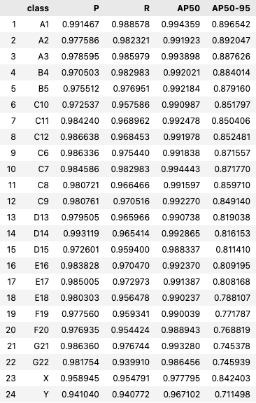
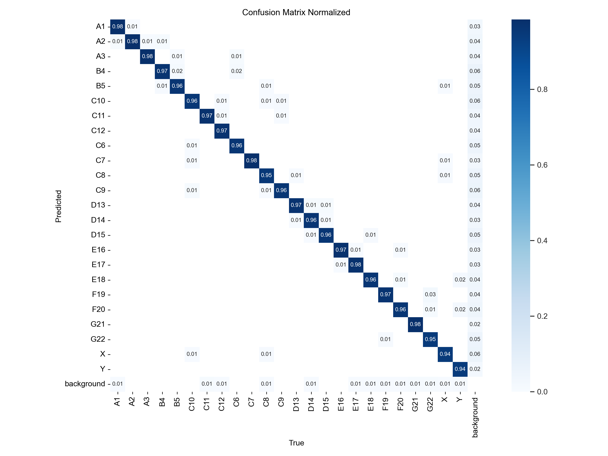
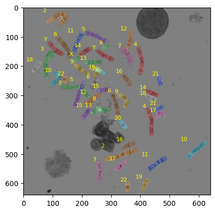
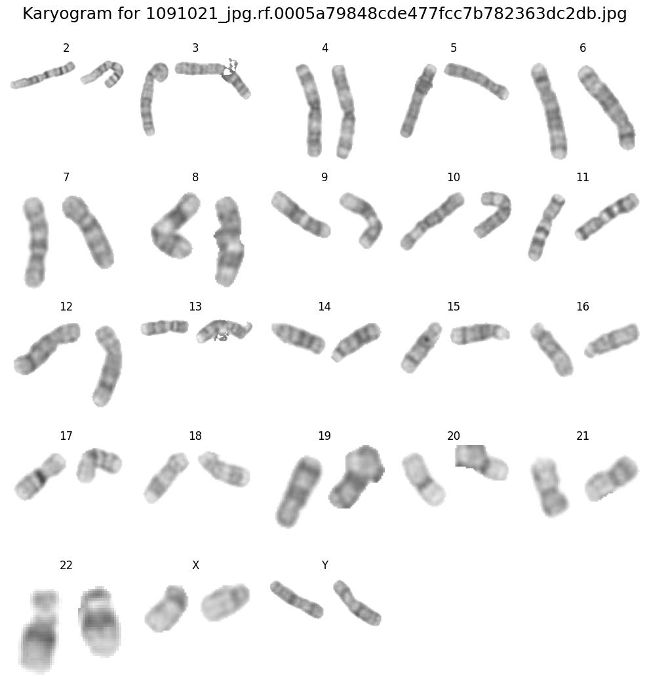

# Automated Cytogenetics

Though well-established, manual karyotype analysis is labor-intensive and relies on expert interpretation. The development of automated systems offers the potential to enhance diagnostic efficiency by significantly reducing the time required for analysis, minimize human error, and standardize the diagnostic pipeline to improve reproducibility and accessibility in clinical settings.

## Approach

The proposed solution has four phases: chromosome detection, chromosome segmentation, karyogram synthesis, and cytogenetic analysis. 

## Chromosome Detection
I fine-tuned You Only Look Once, version 11 (YOLOv11) to perform chromosome detection at the bounding box level. For this phase, bounding boxes are sufficient to at least enable detection of aneuploidy.  After fine-tuning for 30 epochs, the resulting model achieved a mean average precision of 0.99 mAP50 and 0.83 mAP50-95 on the held-out test dataset, suggesting that the model is already generalizing well.  Per-class performance is similarly strong, with the exception of the X and Y chromosomes, which are still detected at an average precision at 50 IOU of 0.98 and 0.97 respectively. 

**Figure 1**

*Per-class object detection metrics*

**Figure 2**

*Normalized Confusion Matrix*

## Chromosome Segmentation

For segmentation, I used Meta’s Segment Anything Model v2 (SAMv2), which performs well in generalizing across diverse chromosomal shapes and sizes, and preserving intricate chromosomal details, such as banding patterns, critical for downstream analysis. 
What I found is that no fine-tuning is required for SAMv2 to perform well when provided with the detected bounding boxes for each chromosome.  

**Figure 3**

*Example output from chromosome segmentation given detected bounding boxes*

Chromosome segmentation involves precisely isolating 24 distinct chromosomes, including 22 autosomes and two sex chromosomes (X and Y). Each chromosome is characterized by unique features such as size, centromere position, and banding patterns:
Autosomes (1–22): Chromosomes 1 through 22 vary in size and gene density. For example, chromosome 1 is the largest, containing genes crucial for brain development and cell cycle regulation, while smaller chromosomes like 21 and 22 are gene-dense and associated with conditions like trisomy 21.
Sex Chromosomes (X and Y): The X chromosome contains numerous genes essential for development and metabolism, while the Y chromosome primarily carries genes related to male sex determination and reproduction.
Each chromosome’s structural and numerical integrity directly impacts cellular function and organismal development. The automated segmentation ensures precise differentiation of these chromosomes to identify abnormalities effectively.

## Karyogram Synthesis
In this phase, the isolated chromosomes are extracted from the original image with their information intact, and grouped together for easy comparison.  In a healthy example, there are 2 of each chromosome, as seen in the synthesized karyogram below.

**Figure 4**

*Example of automated karyogram output*

## Chromosomal Disorder Detection

For cytogenetic analysis, aneuploidies can be detected by simply counting the number of detected chromosomes of each type. (Berisha et al., 2020)
Aneuploidy Detection:
Quantifying the number of chromosomes to identify numerical aberrations, such as trisomies or monosomies.

Commonly identified aneuploidies include:

* Trisomy 21 (Down syndrome): Characterized by intellectual disability and distinct facial features, caused by an extra copy of chromosome 21.
* Trisomy 18 (Edwards syndrome): Associated with severe developmental delays and organ malformations.
* Trisomy 13 (Patau syndrome): Leads to profound neurological and physical abnormalities, with a high neonatal mortality rate.
* Monosomy X (Turner syndrome): Manifests as short stature, infertility, and cardiovascular defects in females.
* XXY (Klinefelter syndrome): Results in male hypogonadism, infertility, and often subtle cognitive impairments.

Structural Variation Analysis:
Categorizing segmented chromosomes based on deviations in banding patterns or morphological structure.
Common structural abnormalities include:
* Deletions: Loss of genetic material, as seen in Cri-du-chat syndrome (deletion on chromosome 5p).
* Duplications: Extra copies of genetic regions, which may lead to gene overexpression and developmental issues.
* Inversions: Rearrangement of genetic material within the same chromosome, which may disrupt gene regulation.
* Translocations: Exchange of genetic material between non-homologous chromosomes, frequently observed in cancers such as chronic myeloid leukemia

This framework not only identifies common disorders but also provides a foundation for recognizing novel or rare chromosomal anomalies through advanced learning algorithms, by capturing precise structural data about each detected chromosome. 

## References

Berisha, S. Z., Shetty, S., Prior, T. W., & Mitchell, A. L. (2020). Cytogenetic and molecular diagnostic testing associated with prenatal and postnatal birth defects. Birth Defects Research, 112(4), 293–306. https://doi.org/10.1002/bdr2.1648

chromosomal abnormalities Dataset and Pre-Trained Model by chromosome. (n.d.). Roboflow. Retrieved December 17, 2024, from https://universe.roboflow.com/chromosome-sjydn/chromosomal-abnormalities/health

Pallavoor, A. S., A, P., Ts, S., & Pallavoor, S. K. (2022, September 12). Chromosome segmentation analysis using image processing techniques and autoencoders. arXiv.Org. https://arxiv.org/abs/2209.05414

Saleh, H. M., Saad, N. H., & Isa, N. A. M. (2019). Overlapping Chromosome Segmentation using U-Net: Convolutional Networks with Test Time Augmentation. Procedia Computer Science, 159, 524–533. https://doi.org/10.1016/j.procs.2019.09.207

You, D., Xia, P., Chen, Q., Wu, M., Xiang, S., & Wang, J. (2023). AutoKary2022: A large-scale densely annotated dataset for chromosome instance segmentation. 2023 IEEE International Conference on Multimedia and Expo (ICME), 1577–1582. https://doi.org/10.1109/icme55011.2023.00272